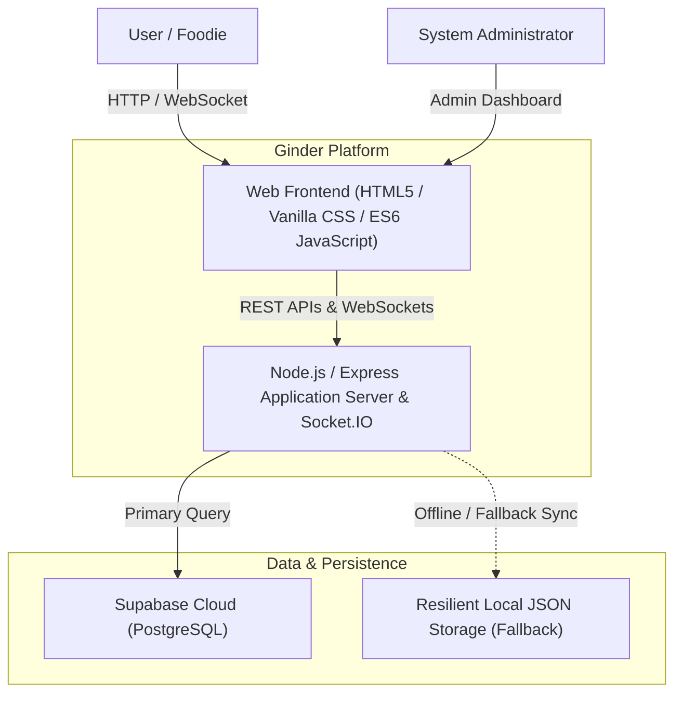
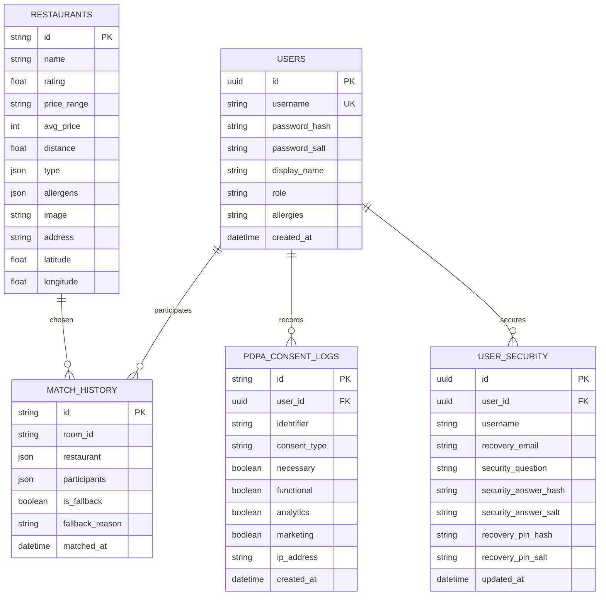

# GINDER — System Architecture & Engineering Blueprint

> Documented in compliance with Software Engineering Standards (Skills 01–10).

---

## 1. Requirements Engineering & UX Design (Skill 01)

### 1.1 Core Principles
* **User-Centricity (Guest-First)**: Users enter the platform immediately without login friction. Automatic guest provisioning assigns a temporary profile (`guest_xxxx`), allowing immediate solo swiping or group joining. Voluntary authentication is available anytime.
* **Efficiency & Minimal Clicks**:
  * Solo mode: 1 click to start swiping.
  * Food tag selector: Collapsible toggle panel allowing users to show/hide cuisine filters on demand without cluttering the screen.
* **Error Prevention**:
  * **Room Existence Pre-Check**: The client performs a pre-flight check (`POST /api/check-room`) before allowing users to join a multiplayer room, preventing invalid room entries and confusing disconnects.
  * **Allergen Protection**: Dynamic blacklist filtering ensures users never receive recommendations containing their declared allergies.

---

## 2. System Design & Component Architecture (Skill 02 & Skill 03)

### 2.1 System Context Diagram (C4 Level 1)

### 2.2 Component Structure (Skill 03: Separation of Concerns)
* **Presentation Layer**: `templates/index.html`, `templates/admin.html`, `static/style.css`.
* **Client Logic Layer**: `static/app.js` (State machine, touch gestures, geolocation API, Socket.IO client).
* **API & Controller Layer**: `server.js` (Express routers, input validation, rate limiting, security headers).
* **Realtime Engine**: Socket.IO event bus (Room lifecycle, swipe broadcasts, unanimous matching algorithm).
* **Persistence & Repository Layer**: Dual-storage adapter (Supabase PostgreSQL + Local JSON filesystem fallback).

---

## 3. Database Design & Resilient Storage (Skill 04)

### 3.1 Entity Relationship Diagram

### 3.2 Dual-Storage Architecture (Resilience & Zero Downtime)
If Supabase cloud database is temporarily unreachable, the system gracefully falls back to local structured JSON storage (`data/mock_restaurants.json`, `data/history.json`, `data/user_recovery.json`). Data is mirrored locally upon each modification to prevent data loss.

---

## 4. API Design & Specifications (Skill 05)

| Method | Endpoint | Description | Auth Required | Rate Limit |
| :--- | :--- | :--- | :--- | :--- |
| `GET` | `/api/health` | Service healthcheck, uptime & version | No | None |
| `GET` | `/api/me` | Current session / Auto-provisioned guest | Session | None |
| `POST` | `/api/signup` | Register user with PDPA consent | No | 20 req/min |
| `POST` | `/api/login` | Authenticate user | No | 20 req/min |
| `POST` | `/api/logout` | Reset session to guest user | Session | None |
| `POST` | `/api/solo/deck` | Get filtered restaurant card deck | No | None |
| `POST` | `/api/check-room`| Validate room code existence | No | None |
| `POST` | `/api/auth/forgot/send-email-otp` | Request password reset OTP | No | 5 req/min |
| `GET` | `/api/restaurants` | List all restaurants | No | None |

---

## 5. OWASP Top 10 Security Hardening (Skill 09)

1. **A01: Broken Access Control**: Strict role verification (`getUserRole(req) === 'admin'`) protects `/admin` and `/api/admin/*`.
2. **A02: Cryptographic Failures**: Passwords, recovery PINs, and security answers are hashed using `crypto.pbkdf2Sync` with SHA-256, 100,000 iterations, and cryptographically secure random 16-byte salts.
3. **A05: Security Misconfiguration**:
   - `x-powered-by: Express` disabled.
   - HTTP Security Headers enforced:
     - `X-Content-Type-Options: nosniff`
     - `X-Frame-Options: SAMEORIGIN`
     - `X-XSS-Protection: 1; mode=block`
     - `Referrer-Policy: strict-origin-when-cross-origin`
     - `Content-Security-Policy`
4. **A07: Identification and Authentication Failures**:
   - Sliding-window in-memory rate limiters on `/api/login`, `/api/signup` (20/min) and OTP generation (5/min).
   - Session cookies configured with `httpOnly: true`, `sameSite: 'lax'`, and configurable `secure` flag.
5. **Memory Flooding & DoS Prevention**: Express request body limit restricted to `1mb`.

---

## 6. Testing, QA & CI/CD (Skill 07 & Skill 10)

* **Automated Test Suite**: Located at `tests/api.test.js`. Runs with zero external dependencies using Node.js native libraries.
* **Continuous Integration**: `.github/workflows/ci.yml` performs syntax checks, dependency validation, background server startup, and test suite execution on every pull request and push to main.
* **Containerization**: Production-ready `Dockerfile` based on `node:20-alpine`, running under non-root unprivileged `node` user with an automated Docker `HEALTHCHECK` probe against `/api/health`.
